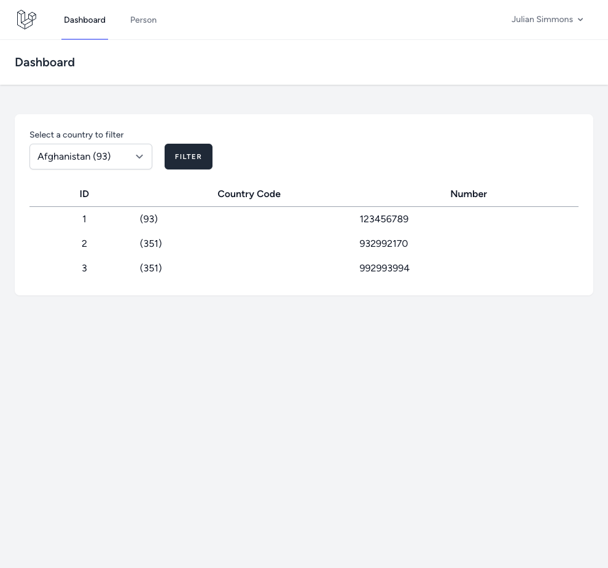
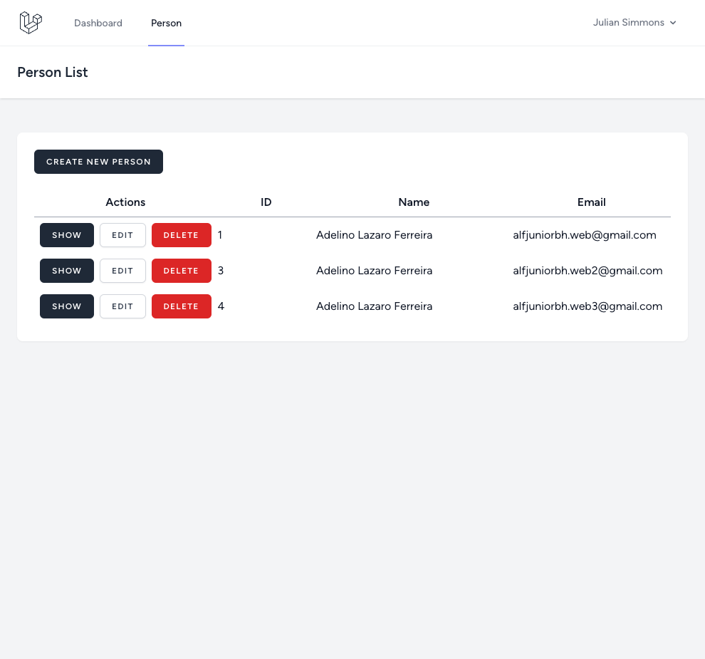
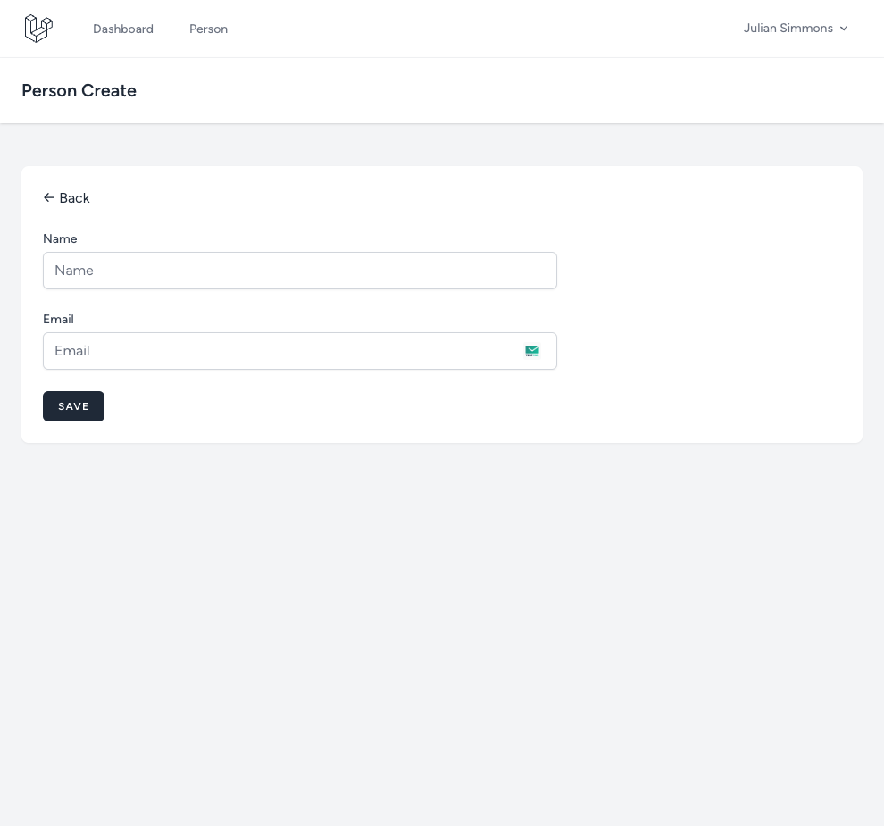
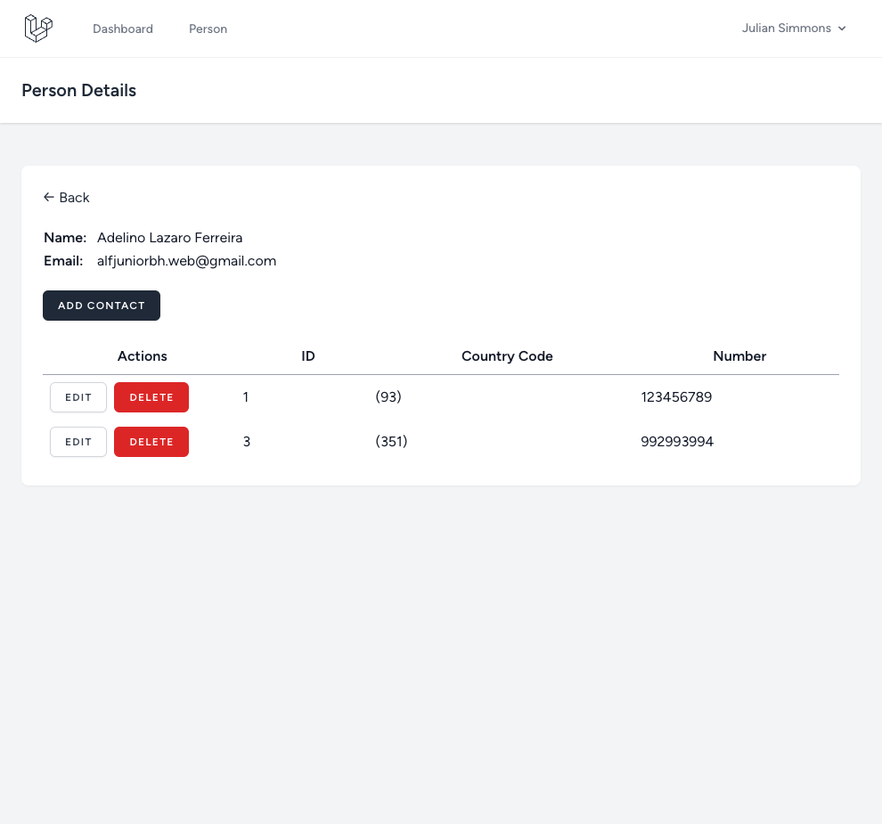
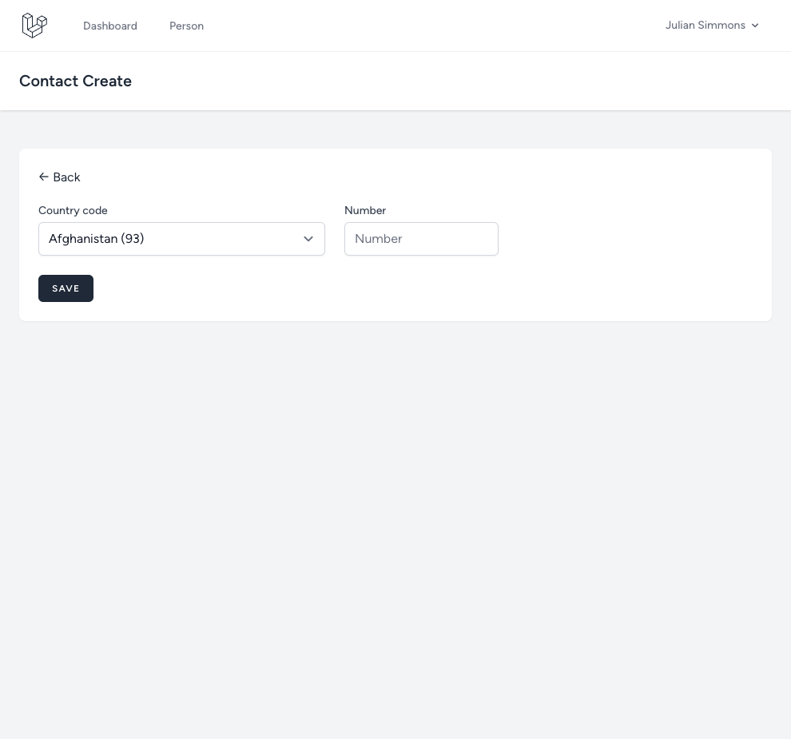

## About Project

### A traditional web application to manage contacts

Application Features:

-   1 - A page to list existing people.
-   2 - A page to add a new person or edit an existing person.
-   3 - A page to show the person details.
-   4 - A page to add a new contact or edit an existing contact.
-   5 - Allow deletion of a person.
-   6 - Allow deletion of a contact.

## Requirements

A person is an entity with 3 fields: ID, name and email address. Name should be a string of any size greater than 5 and email should be a valid email address.

A person can have any number of contacts. A contact is an entity with 3 fields: ID, CountryCode and Number. Number should be exactly 9 digits, CountryCode should be the callingCodes value obtained from an external API.

The following API contains country information, including names and calling codes: https://restcountries.com/

The form for adding a new contact should display a searchable dropdown where the user will select the country as well as an input to type the number. The list of countries displayed to the user should contain the country name and the calling code within (). - example: Portugal (351)

The countries displayed in the dropdown should come directly from the API and allow searching using the API filtering features.

Contacts saved to the database should contain the inserted number and a reference to the selected calling code.

Each row in the person list page should have a link to show the details of the person, a link to edit the person and a button to delete the person. The delete should perform a soft delete of the record, keeping the record in the database but not visible.

The person details page should show all the fields of the person as well as the list of contacts associated with the person. plus the edit link and the delete button. There should also be a button for creating a new contact associated with the person.

Each of the contacts in the person details page should have an edit link and a delete button.

Contact and email address should be unique within the system. There cannot be multiple people with the same email address, nor any duplicate contact tuple (CountryCode + Number).

### Installation

-   1 - Install Lavarel in your local environment: https://laravel.com/docs/10.x
-   2 - git clone https://github.com/adelino-masioli/alfasoft
-   3 - cd alfasoft
-   4 - cp .env.example .env
-   5 - php artisan key:generate or you can also use sail to handle this
-   6 - composer install
-   7 - npm run dev or npm run build

### Screenshots

    

    

    

    

    

